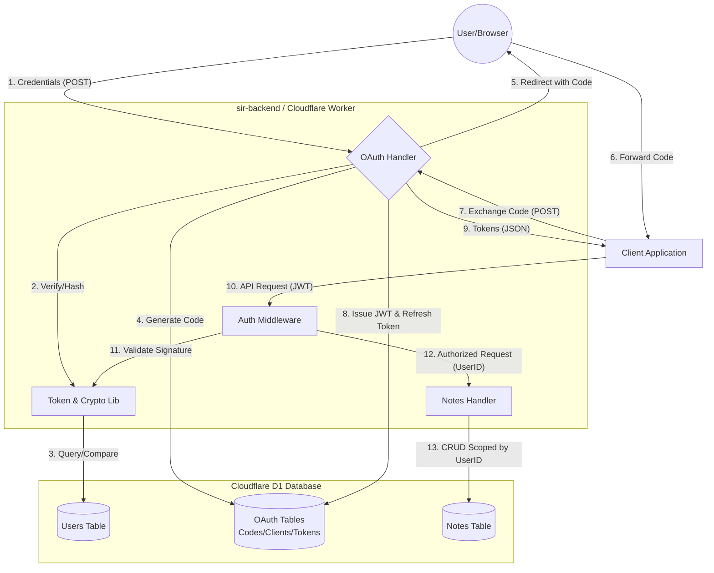

# Data Flow Diagram (DFD)

This document illustrates how data flows between entities, processes, and data stores within the `sir-backend` system.

---

## 1. High-Level Data Flow

The following diagram shows how information (Credentials, Codes, Tokens, and Resources) moves through the system.

---

## 2. Data Elements & Security

| Data Element | Sensitivity | Transformation | Storage Policy |
| :--- | :--- | :--- | :--- |
| **User Password** | High | Hashed via Argon2/HMAC | Never stored in plain text. |
| **Auth Code** | Medium | Random 32-char string | Stored in D1, marked `used` after 1 min. |
| **Access Token (JWT)** | High | Signed with HS256 (JWT_SECRET) | **Not stored** on server (Stateless). |
| **Refresh Token** | High | Random 48-char string | Stored in D1, revoked after use (Rotation). |
| **User Notes** | Medium | None (Scoped to UserID) | Stored in D1, accessible only by owner. |

---

## 3. Security Boundaries

1.  **Trust Boundary: User Browser <-> Server**
    *   Data is protected via **TLS (HTTPS)**.
    *   Credentials are sent only via POST body to prevent logging in URLs.
2.  **Trust Boundary: Client App <-> Server**
    *   The `client_secret` acts as the primary authentication for the Client.
    *   Loopback enforcement prevents "Inter-app communication" attacks on the authorization code.
3.  **Persistence Boundary: Server <-> D1**
    *   The database is only accessible by the Worker via the `DB` binding.
    *   ORM hooks ensure IDs and Timestamps are generated in a trusted environment before hitting the disk.

---

## 4. Lifecycle of a Note (Data Flow Example)

1.  **Input**: Client sends `{ "title": "Secret", "content": "..." }` + `Authorization: Bearer <JWT>`.
2.  **Extraction**: Middleware decodes JWT, verifying it hasn't been tampered with using the server's secret. It extracts `sub: "user_123"`.
3.  **Process**: Handler receives the request and explicitly constructs a DB query: `INSERT INTO notes VALUES (user_id="user_123", ...)`.
4.  **Storage**: D1 writes the record to the encrypted persistent store on the Cloudflare Edge.
5.  **Output**: JSON representation of the saved note is returned to the Client.
