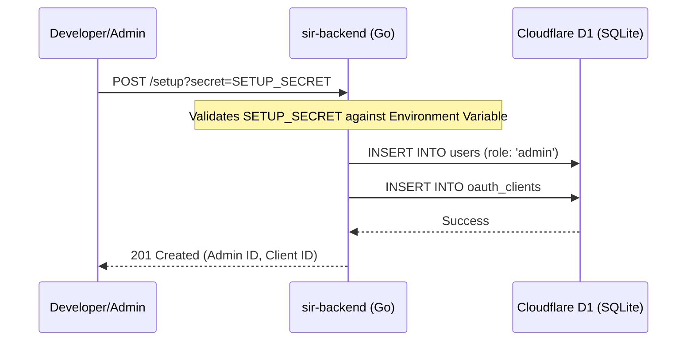
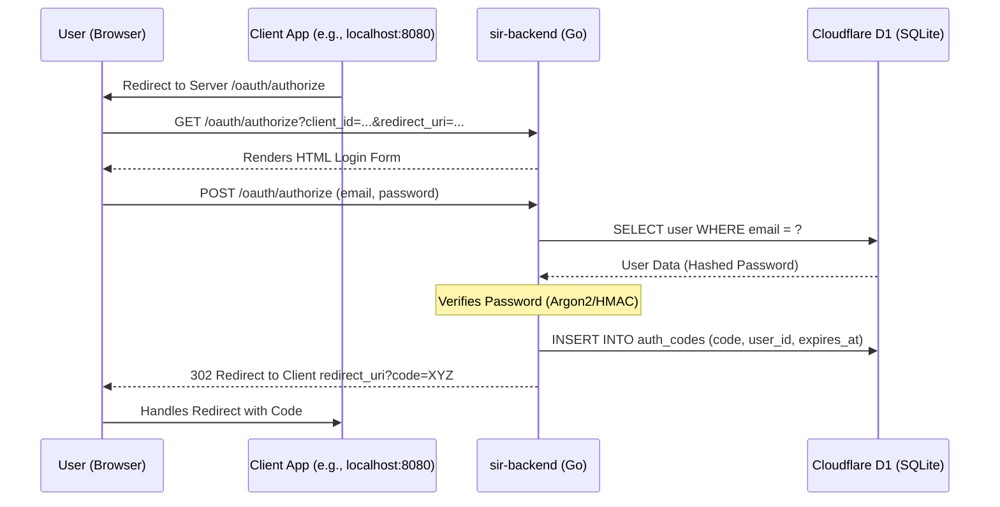
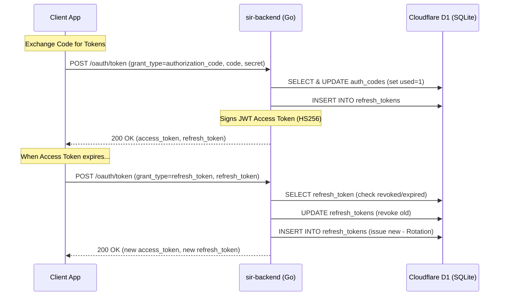
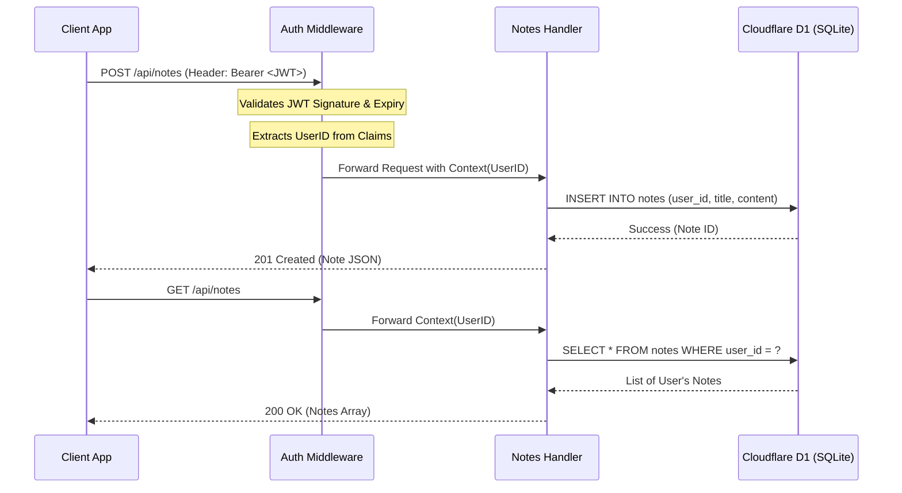

# End-to-End System Flow

This document provides a visual and technical breakdown of the `sir-backend` system flows, separated by **Client Perspective** and **Server Internal Logic**.

---

## 1. System Bootstrapping (Initialization)

Before any users can log in, the system must be seeded with an admin and a client.

---

## 2. OAuth 2.0 Authorization Code Flow (RFC 8252)

This flow describes how a Native/Web application obtains access to a user's account.

### A. Authorization & Login

### B. Token Exchange & Refresh

---

## 3. Resource Access Flow (Notes CRUD)

How an authenticated application manages data.

---

## Flow Summary

### Client-Side Flow
1.  **Directs** user to the login page.
2.  **Captures** the authorization code from the callback URL.
3.  **Exchanges** the code for tokens via a secure back-channel POST.
4.  **Stores** the refresh token securely.
5.  **Attaches** the access token to the `Authorization: Bearer` header for all API calls.

### Server-Side Flow
1.  **Authenticates** the user against D1.
2.  **Issues** short-lived JWTs and long-lived Refresh Tokens.
3.  **Enforces** Refresh Token Rotation (one-time use for refresh tokens).
4.  **Scopes** data access: All database queries for resources (like Notes) are hard-coded to filter by the `UserID` found in the JWT.
